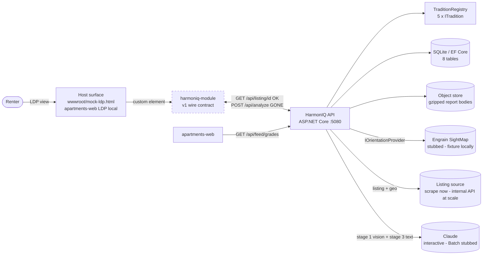
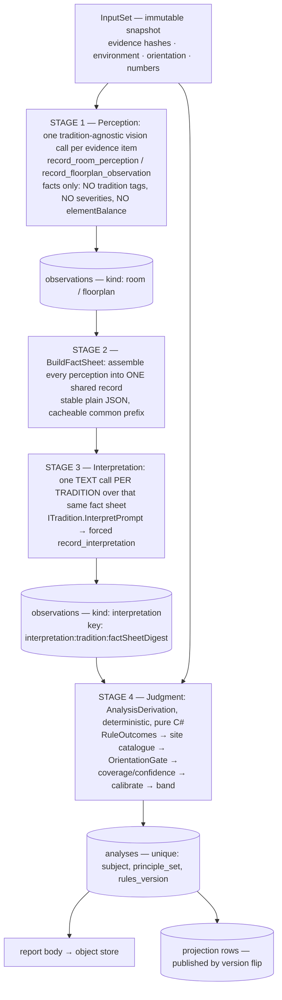
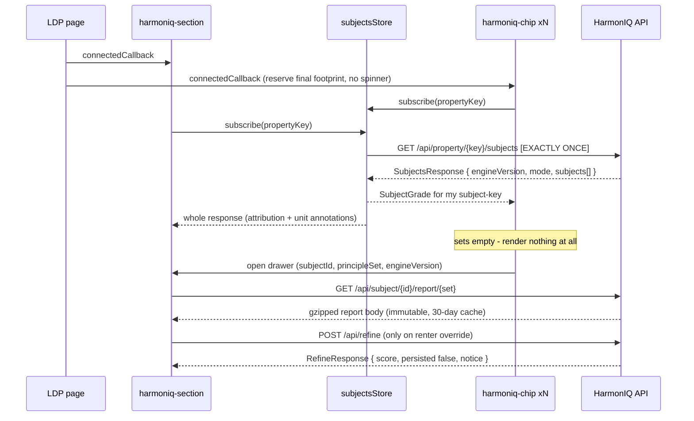

# HarmonIQ — System Architecture (v2, five traditions)

**Status:** backend v2 as-built with the five-tradition layer landed · frontend still on the v1 wire contract
**Spec:** [SPEC.md](../SPEC.md) v2.0 · **Design:** [v2 approved design](superpowers/specs/2026-08-11-harmoniq-v2-design.md) · **Plan:** [v2 implementation plan](superpowers/plans/2026-08-11-harmoniq-v2.md)
**Verified against the working tree on 2026-08-11:** `dotnet build` clean · `dotnet test` **312 passed, 1 failed** (one stale assertion — §16.4).

> Where this document and the design doc disagree, **the design doc wins**.
>
> **v2 grades are not comparable to v1 grades.** The score arithmetic, the subject, and the
> aggregation rules all changed. A v1 "B+" and a v2 "B+" are different measurements.
>
> **§11 and §16 are the honest part.** The backend now scores five traditions through a three-stage
> pipeline. The frontend still calls an endpoint that no longer exists — see
> [§11.2](#112-the-live-break-the-frontend-calls-an-endpoint-that-no-longer-exists).

HarmonIQ grades apartments against **five cultures' spatial-harmony traditions** and surfaces the
result on the host listing page. v1 was a stateless, one-score-per-listing, analyze-on-view demo. v2
is a **precomputed, persisted, per-floor-plan, per-tradition scoring system** with an orientation
seam, a floor-plan vision lens, a versioned grades feed, and search integration.

---

## 1. What changed from v1, and why

| v1 | v2 | Reason |
|---|---|---|
| One score per listing | One score per **subject** — a floor plan on multi-plan properties, the property on single listings | A 342-unit property with 6 plans has 6 different layouts; one grade for all of them is a fiction |
| One blended headline number (`0.7·rooms + 0.3·site ± numerology`) | **Five stored per-tradition scores, never blended, never ranked against each other** | The v1 shared-rule-list engine makes a blended number non-decomposable — you cannot say what it measured. Ranking traditions implies they measure the same thing |
| `70 + 5·adhering − penalties` | **Normalized rule scoring**: severity-weighted fraction of *applicable* rules satisfied | The v1 form made missing evidence flattering (all-unknown = a clean B−) and gave evidence-rich listings higher variance |
| Missing evidence silently absorbed | **Coverage-weighted aggregation + confidence floor (0.5)** → `insufficient_evidence`, no grade | Missing evidence must reduce a lens's *weight*, never its *score* |
| Analyze on view, per renter | **Precompute, store, publish by version flip** | A vision call cannot sit in an SRP request path, and 100k properties cannot be scored per-view |
| Orientation guessed / renter-supplied | **Engrain SightMap is the only orientation source**; the directional traditions require it | Geocoding never yields orientation; Vastu without a facing is "Vastu with Vastu removed" |
| Numerology folded into the score (±3) | **Removed from scoring entirely (FR-20).** Cultural annotation only | Units are not subjects; a number must not compete with the plan's grade. **Closed — see §5.5** |
| Interiors from photos only | Two mutually exclusive **evidence paths**: `floorplan` (multi-plan) or `photos` (single listing) | Marketing photos on a multi-plan property belong to no particular plan |
| One vision call tagged `fengshui \| vastu \| both` | **Three-stage pipeline**: tradition-agnostic perception → shared fact sheet → one interpretation per tradition | `"both"` was a two-tradition encoding with no meaning across five. Vision spend stays 1× and every tradition reasons over identical evidence |
| No storage | EF Core + SQLite (Postgres-shaped), object store for report bodies | Everything above depends on persistence |

---

## 2. System context



The dashed node is the gap: the API speaks v2/five-tradition, the element speaks v1. The **target**
wiring is [§11.3](#113-target-three-custom-elements-one-bulk-fetch).

Three properties still drive every decision:

| Property | Consequence |
|---|---|
| **Zero input from anyone** | The host page supplies a property key. Everything else is derived. |
| **Guest on someone else's page** | Shadow DOM both directions, `defer`, **no layout shift by construction**, fail-inert. |
| **Never dead-ends, never lies** | Demo mode always renders; an absent grade renders as an *explained absence*, never as `F`, `0`, or empty bars. |

---

## 3. The tradition layer

The newest and now most load-bearing abstraction. Before it, each tradition was smeared across four
files — its prompt in `Prompts`, its site rules in `SiteAnalysisService`, its numerology in
`NumerologyService`, its gating in `VastuGate` — every one a binary
`principleSet == Vastu ? … : …`. Five traditions would have meant five-way switches in five places.

`Services/Traditions/ITradition.cs` makes one culture's tradition a **single self-contained unit**:
its prompt, its site catalogue, and its numerology live together, so someone who knows the tradition
can review all of it at once. Implementations are pure, stateless singletons — callable from
read-time paths with no DI scope and no database.

| Id | Display name | Order | `RulesVersion` | Orientation-gated | Reads wǔxíng |
|---|---|---|---|---|---|
| `fengshui` | Feng Shui | 1 | `fengshui-2.0` | no | **yes** |
| `vastu` | Vastu Shastra | 2 | `vastu-2.0` | **yes** | no |
| `pungsu` | Pungsu-jiri | 3 | `pungsu-1.0` | no | **yes** |
| `kaso` | Kasō | 4 | `kaso-1.0` | **yes** | **yes** |
| `phongthuy` | Phong Thủy | 5 | `phongthuy-1.0` | no | **yes** |

A tradition's culture of origin is deliberately **not** modelled. It was once carried as
`ITradition.Culture` and rendered as a renter-facing label ("Korea — Pungsu-jiri"); country and
culture names have since been removed from every renter-facing surface, so the field was deleted
rather than blanked. Doctrine bodies still name related traditions by culture where they explain a
genuine divergence — that is doctrinal content, not a label.

**`TraditionRegistry` is the single place that knows which traditions exist.** Everything downstream
— scoring, gating, numerology, prompts, search synonyms, rules versions, display order — resolves
through it rather than switching on a string. `PrincipleSets.All` and `PrincipleSets.IsKnown` now
delegate to `TraditionRegistry.Ids` / `.IsKnown`. Adding a sixth tradition is **one new
`ITradition` implementation plus one line in `Ordered`**.

The interface surface, and why each member is there:

| Member | Purpose |
|---|---|
| `Id` / `DisplayName` / `Order` | Wire id and renter-facing label. Order is display order — **never** "highest score first", which would rank traditions. |
| `RulesVersion` | Scoped per tradition so a Kasō rule change never invalidates Feng Shui analyses (FR-41). |
| `RequiresOrientation` | Declares the orientation gate. Vastu's directional room placement and Kasō's kimon axis are absolute-directional; the remainder would be "the tradition with the tradition removed". |
| `UsesWuxing` | True for the four Sinitic traditions. **False for Vastu** — its pancha bhuta are a different five (earth/water/fire/air/space) and cannot ride in the same `ElementBalance` shape, so its section is omitted rather than zeroed. |
| `TraditionPhrase` | Framing clause for generated prose, e.g. "in Vastu Shastra terms". |
| `SearchSynonyms` | Query spellings including native script — 风水/風水, वास्तु, 풍수지리, 家相, phong thủy. |
| `SiteCatalogue(env, cardinal)` | This tradition's deterministic reading of the site. No model call. |
| `Numerology(subject, value)` | This tradition's reading of one number — a rules engine, not the LLM (FR-18). |
| `RuleTitle` / `RuleRemedy` | Report rendering and renter-feasible remedies for this tradition's rule ids. |
| `OrientationGateExplanation` | The explanatory absence shown instead of a grade when gated off. Kasō explains the kimon; Vastu explains directional placement. |
| `InterpretPrompt(factSheet, orientationHint)` | Stage-3 prompt. |

**Shared, deliberately not per tradition:** `SiteRules` (the unknown-is-not-a-violation invariant,
FR-16, enforced once), and `InterpretPromptBuilder`'s guardrails — the no-superlatives rule (NFR-8),
the renter-feasibility rule, and the tradition-framing rule are safety properties of the *product*,
not of any one tradition, and duplicating them five times would let them drift apart.

**`TraditionDivergenceTests` proves the five actually differ** rather than being one engine wearing
five labels: nine is auspicious in Chinese practice and inauspicious in Japanese; seven is
inauspicious in Vietnamese practice and auspicious in Korean and Japanese; four is inauspicious
across every Sinitic tradition; Vastu reads by digit sum rather than homophone; water in the
north-east is favourable in Vastu and flagged in Kasō; the five do not score the same site
identically; rule ids are namespaced per tradition; and Pungsu's flank rule is chirality-free.

---

## 4. The subject model

Scoring attaches to a **subject**, not a listing.

```
property has ≥2 distinct floor plans  →  one `floorplan` subject per plan, and NO property subject
property has 0 or 1 floor plan        →  one `property` subject
units                                 →  never subjects, never rows
```

- **Discriminator is the plan count, not the unit count.** A plan with one available unit alongside
  four other plans is still the multi-plan case.
- **Identity is the scraped `data-rentalkey`** (present on 11/11 surveyed multi-plan LDPs). Visible
  plan names are *not* unique — one surveyed property repeats "1 Bed 1 Bath" ~10×. Fallback identity
  is a **perceptual** image hash + beds/baths; an **ambiguous match writes no row** (a wrong grade is
  worse than a null).
- **A plan with no floor-plan image is not scored at all** — no observation, no analysis row, no
  chip, no placeholder. Site+numbers alone would clone one grade across every plan on the property.
  Such a subject is still returned by the API (with an empty `sets` list) so the page's footprint is
  known at first paint.

Subject ID format: `"{propertyKey}"` or `"{propertyKey}:{rentalKey}"`.

---

## 5. The three-stage pipeline

This is the load-bearing structure of v2, and it changed shape when the tradition count went from
two to five. Model output and scores remain separate tables with separate lifetimes.



| Layer | Cost | Invalidated by | Consequence |
|---|---|---|---|
| Stage 1 `observations` | Expensive (Claude **vision**) | evidence hash, prompt version, model id | 1× however many traditions are scored |
| Stage 3 `observations` | Moderate (Claude **text**) | fact-sheet digest, prompt version, model id | Adding a sixth tradition re-runs **only that tradition** |
| Stage 4 `analyses` | Free (pure C#) | `rules_version` (**per tradition**) | An engine bump is batch SQL re-derivation |

Three decisions fall out of this and are worth stating plainly:

- **Perception takes no view.** Stage 1 records what is *physically there* — objects, positions,
  sightlines, adjacencies, light, materials — and is instructed to **over-record**, noting facts even
  when their significance is unclear, because a fact this pass misses is unavailable to every
  interpreter downstream. It emits no tradition tag, no severity (a severity is a judgement), and no
  `elementBalance` (wǔxíng is a reading, not an observation).
- **Every tradition reasons over identical evidence.** That is the property that actually matters on
  a listing page: a difference between two traditions' scores is attributable to *the traditions*,
  not to what one call happened to notice.
- **`rules_version` is per tradition.** A Vastu rule change must not invalidate Feng Shui analyses.

**Stage-3 cache key** is `interpretation:{traditionId}:{sha256(factSheet)[..16]}`. Folding the fact
sheet's digest in means any upstream observation change invalidates every tradition's reading of it,
while a *new* tradition costs exactly one new call per subject.

**Stage 3 is live-only.** The demo path's fixtures carry tradition-tagged findings already, and demo
must stay fully functional with no key and no model call.

**Immutable input snapshots.** Ingest writes an `InputSet` — evidence hashes, environment snapshot,
resolved orientation, unit numbers — and scoring reads *only* the snapshot. The fingerprint derives
from the snapshot. This kills the ingest/scoring race and makes "did anything actually change?" a
hash comparison.

**Findings below `FindingConfidenceFloor` (0.5) do not move a grade.** They stay in the report body
as recorded observations; they just do not enter the arithmetic.

### Tag semantics after the change

`LensFinding.Tradition` is now overloaded by stage, and the two paths treat a blank differently on
purpose:

- **Blank on a stage-1 room perception** = an untagged fact. `RoomLens` **excludes** it from scoring
  — otherwise every tradition would inherit the same undifferentiated findings — but it still renders
  on the report's room cards.
- **Blank or `"both"` on the floor-plan path** = tradition-neutral, and `Matches` accepts it. That is
  accurate there: adjacency relationships are facts, not readings.

---

## 6. Scoring arithmetic

### 6.1 Normalized rules

```
Score01(lens, set) = Σ(severityᵢ · satisfiedᵢ) / Σ(severityᵢ)     over APPLICABLE outcomes only
Coverage(lens,set) = applicable rules / evaluable rules            ∈ [0,1]
```

A 3-rule evaluation and a 12-rule evaluation with the same satisfied fraction land on the same
scale. Unknown environment values produce `Applicable = false` — never a violation.

### 6.2 Coverage-weighted aggregation

```
score(set)      = Σ(wᵢ·cᵢ·sᵢ) / Σ(wᵢ·cᵢ)        w: interiors .70, site .30
confidence(set) = Σ(wᵢ·cᵢ)
confidence < 0.5 → status = insufficient_evidence, score = null, grade = null
```

Missing evidence reduces a lens's **weight**, never its score. The floor makes the unscored case
natural and keeps surviving grades honest. `NotDeterminable` from the floor-plan lens →
`Coverage = 0` → insufficient evidence, **not** a low score.

**Interiors coverage is multiplicative across stages:** `perceptionCoverage × interpretationCoverage`.
Perception's coverage measures how much the photographs showed — a property of the *evidence*, not of
the tradition reading it — and the interpreter states separately how much of its own rule set the
record let it evaluate.

### 6.3 The orientation gate

`OrientationGate.CanScore` (formerly `VastuGate`) returns false for a tradition whose
`RequiresOrientation` is true when no facing has resolved, and this **overrides renormalization**:

- Stored, filterable **Vastu and Kasō grades exist only where SightMap orientation resolved.**
- Elsewhere the UI shows that tradition's own `OrientationGateExplanation` — Kasō explains the kimon
  (鬼門), Vastu explains directional placement.
- The Refine drawer may compute a **session-only** score from renter-supplied orientation
  (`POST /api/refine`) — displayed, never persisted, never filterable.
- **The three ungated traditions degrade gracefully** without orientation: their directional rules
  drop to not-applicable, which lowers coverage (and that lens's weight) rather than the score.

Which traditions are gated is **declared by each tradition**, not listed in the gate.

### 6.4 Cohorts, not disclaimers

Every score carries `(evidencePath: photos|floorplan, orientationPath: with|without)` — e.g.
`"floorplan/without"`. **Ranking, filtering, and thresholds apply within cohort**, using per-cohort
calibration constants stored on the engine version and derived offline by task zero. Calibration is
**never computed at read time**; absent constants are identity `(0, 1)`.

### 6.5 Numbers — the divergence is closed

**Numerology adjusts no stored score (FR-20).** v1's ±3 mechanism is gone throughout, and the code
says "do not reintroduce it":

- `ScoreMath.Aggregate` no longer takes a `numerologyAdjustment` parameter, and
  `MaxNumerologyAdjustment` is deleted.
- `SetScore.NumerologyAdjustment` and `ReportBody.NumerologyAdjustment` are removed from the contracts.
- `NumerologyService.EvaluateSubject` returns `ScoreAdjustment = 0` always.
- `AnalysisPipeline` explicitly writes `row.NumerologyAdjustment = null`; the DB column stays
  nullable-and-null **pending its migration-out**.

Both surfaces are now annotation only: subject-level checks (building floor, street number — never
the unit number, since a subject may host many units) render on the report's Numbers card (FR-19),
and **per-unit** annotations are computed at read time from the availability table
(`SubjectsReadService.UnitsForAsync`), never persisted, with no letter, no 0–100, and no
score-colored chrome. Each tradition supplies its own reading via `ITradition.Numerology`; the
service keeps only the tradition-independent Western check.

### 6.6 Element balance

`ElementBalance` carries **wǔxíng** (五行 wood/fire/earth/metal/water) and is present only for
traditions where `UsesWuxing` is true — the four Sinitic ones. Vastu omits it. It is nullable
end-to-end and **never five zeros**: the report *omits* the section instead. It is also
materials-only, so the floor-plan path never reports one (a line drawing has no materials). Each
wǔxíng tradition derives its own balance in stage 3 from the shared materials list; the demo path
falls back to precomputed per-room balances.

---

## 7. Lenses

| Lens | Engine | Weight | Notes |
|---|---|---|---|
| **Interiors — photos path** | Stage 1 vision per photo (`record_room_perception`) + stage 3 per tradition | .70 | Single listings only |
| **Interiors — floor-plan path** | Stage 1 vision, **one call over the plan image** (`record_floorplan_observation`) | .70 | Multi-plan properties only |
| **Site** | Deterministic per-tradition catalogue over map data — no model call | .30 | Orientation-dependent rules become non-applicable without a facing |
| **Numbers** | Pure rules, per tradition | **annotation only** | Never model-improvised, never scored |

### The floor-plan lens is deliberately narrow

**In scope (adjacency only):** bath adjacent to / over kitchen; bathroom door onto kitchen or dining;
entry-to-rear straight line; toilet sharing the bed-head wall; center-of-unit obstruction (only when
the boundary is fully drawn); kitchen at entry; bed-wall options.

**Out of scope, as schema-level prohibitions:** furniture and staging, mirrors, beams, clutter,
natural-light quality, five-element balance, anything dimensional, door swings, and **anything
chirality-dependent (left/right)** — plans are mirrored for opposite building stacks, so a left/right
claim is wrong half the time. Within-plan sqft varies ("385–431 Sq Ft"), so nothing dimensional may
be scored either.

The chirality prohibition now extends into the site rules: `SiteRules.FlankSides` returns the two
sides perpendicular to the facing as an **unordered pair**, so no tradition rule can depend on which
flank is left and which is right. `TraditionDivergenceTests` asserts it.

**The lens never infers north from a drawing.** Directional placement is a separate layer applied
only when orientation exists.

**A forced tool call must be able to decline:** `minItems: 0` on findings and suggestions, an
explicit `notDeterminable` marker, per-finding `confidence`, a closed `ruleId` enum, and a
model-stated `coverage`. Findings outside the enum are dropped and logged; `center_obstruction` is
dropped when the boundary isn't drawn.

---

## 8. Orientation seam

```
IOrientationProvider.ResolveAsync(propertyKey, subjectId) → SubjectOrientation?
```

`SubjectOrientation(FacingDegrees, Cardinal, Source: sightmap|annotation|none, Confidence, ResolvedAt)`.

**Resolution rule (per plan):** bucket placed units into four cardinal sectors; if **≥80%** fall in
one sector, that is the plan's facing and the concentration ratio is the confidence. Otherwise
`Source = "none"` → the without-orientation path. Units with no facing are excluded from the
denominator; zero placements → `null`.

| Path | Status |
|---|---|
| `SightMapOrientationProvider` + `ISightMapClient` | **Stubbed.** The API (`api.sightmap.com/v1`, API-key auth, unit↔floor↔building↔plan linkage) is real and confirmed; whether unit polygons are exposed as true-north geo-referenced vectors at the relevant tier is **unverified** and is a CoStar↔Engrain partner data request. Never a network call in tests. Selected by `ORIENTATION_PROVIDER=sightmap`. |
| Annotation fallback | If vectors aren't true-north: a one-time per-property rotation annotation from satellite imagery, `Source = "annotation"`. |
| `FixtureOrientationProvider` | **The default and the only exercisable local path.** Covers all three shapes — resolves, splits to `none`, and absent. |

Downstream is agnostic to which path filled the row. Orientation is **never** inferred from a
floor-plan image or a geocode; a >45° disagreement with a footprint bearing is a data-quality **log
line only**, never a score input.

**Orientation now gates two traditions, not one** — which raises the stakes on the SightMap
partner request (§17 risk 2).

---

## 9. Backend structure — as built

### 9.1 Host composition (`Program.cs`, 150 lines, edited exactly once)

In order:

1. `LoadDotEnv()` — walks up from the binary to the repo root, loads `.env` without clobbering real
   env vars.
2. `EnvOverrides()` — maps flat env keys onto config keys (`CLAUDE_API_KEY` → `Claude:ApiKey`,
   `HARMONIQ_DB`, `ORIENTATION_PROVIDER`, `SCORING_MODE`, `TASKZERO_SAMPLE_N`, …), added as an
   in-memory config source so a `.env` value always wins over an OS-level one.
3. Controllers with **camelCase** naming and `WhenWritingNull` — this is why a null `score` is
   *absent* from the JSON rather than `0`.
4. Three **v1-legacy singletons** with no v2 module owner yet: `SampleListingProvider`,
   `IListingService`, `IGeoContextService`. `IngestionModule` depends on them.
5. `AddHarmonIQModules(configuration)` — everything else.
6. **Migrate-on-start** — `Database.Migrate()` before either the web host or a CLI command runs.
7. **CLI seam** — `CommandRunner.TryRunAsync(args, …)`; a recognized `args[0]` runs and exits,
   anything else falls through to normal startup.
8. CORS `AllowAnyOrigin` (needed for the cross-origin real-LDP demo host), `/api/health`,
   `/api/debug/geo`, static files defaulting to `mock-ldp.html`, `MapControllers()`, `/harmoniq`.

### 9.2 DI — the module seam

Every area registers itself via `Infrastructure/<Area>Module.cs : IServiceModule`, discovered by
`ServiceModuleRegistration.AddHarmonIQModules` (assembly scan, **stable `FullName` ordinal order**,
parameterless ctor required). This is what let a dozen tasks land in parallel without contending for
one file, and it is why adding a service later never touches host wiring.

| Module | Registers | Lifetime notes |
|---|---|---|
| `PersistenceModule` | `HarmonIQDbContext` (SQLite, `HARMONIQ_DB`, default `./.harmoniq-local/harmoniq.db`), `IObjectStore` → `FileSystemObjectStore` | Context scoped; store singleton |
| `IngestionModule` | `IPlanScraper`, `IPlanImageLoader`, `IPlanSource` (→ `SampleListingProvider`), `ISubjectService` | `ISubjectService` scoped (holds the context) |
| `OrientationModule` | `IOrientationProvider` — fixture by default, SightMap when `ORIENTATION_PROVIDER=sightmap` | Singleton |
| `AnalysisModule` | `IClaudeClient`, `MockAnalysisService`, `ClaudeAnalysisService`, `IFloorPlanLens`, `IEvidenceLoader`, `ReportBodyWriter`, `IAnalysisPipeline` | Pipeline **scoped** (writes through the context); shared services via `TryAdd` so no module shadows another |
| `NumerologyModule` | `NumerologyService` | Singleton — stateless and pure |
| `PublishingModule` | `IEngineVersionService`, `IPublicationService` | Scoped |
| `SearchModule` | `ISearchService` | Scoped |
| `ApiModule` | `SubjectsReadService` | **Scoped** — a singleton would capture a disposed context |
| `CommandsModule` | `IScoringDriver` (scoped), `IBatchScoringClient` → stub, `BackfillCommand` | Command is a **singleton** — `CommandRunner` resolves from the **root** provider before any request scope exists, so it takes `IServiceScopeFactory` and opens its own scope |
| `SamplingModule` | `TaskZeroCommand` | Same root-provider constraint |

**The traditions are deliberately not in DI.** `TraditionRegistry` is static, because the traditions
are pure and stateless and because read-time paths (`NumerologyService`, report rendering,
`SynonymMap`'s static table) must be callable with no DI scope.

### 9.3 Persistence

| Table (`DbSet`) | Key facts |
|---|---|
| `subjects` | Materialized (referential integrity + backfill enumeration source) |
| `input_sets` | Immutable snapshot; fingerprint source |
| `observations` | Unique `(SubjectId, EvidenceHash, PromptVersion, ModelId)`. Now holds **both** stage-1 perceptions and stage-3 interpretations, discriminated by `ObservationPayload.Kind` |
| `analyses` | Unique `(SubjectId, PrincipleSet, RulesVersion)`; status `pending\|ok\|failed\|insufficient_evidence`. `NumerologyAdjustment` is now always null, pending migration-out |
| `subject_orientations` | One per subject |
| `engine_versions` | `(rulesFengShui, rulesVastu, promptVersion, modelId)` → version; `CalibrationJson`; `PublishedAt` **null until the flip** |
| `scoring_jobs` | Queue + attempt/error/token/cost record; a `skipped` row is how the imageless plan stays cheap on repeat reads |
| `projection_rows` | What the feed serves; mirrors apartments-web's child-table shape |

**Migrations:** `V2Initial`, then `AddProjectionRowSubjectId` — which adds `ProjectionRow.SubjectId`
as a first-class non-null column. That closes a documented consumer gotcha: the feed previously
carried no subject id, and consumers had to parse it back out of the composite `Id`
(`{engineVersion}:{subjectId}:{principleSet}`), whose composition is an internal detail.

No `units` table. No photo bytes. Report bodies live in `IObjectStore` at
`reports/{engineVersion}/{subjectId}/{principleSet}.json.gz` (gzipped UTF-8 JSON, CDN-cacheable on
drawer-open); the analysis row carries `ReportUri` + `ReportSha256`.

Local stand-ins at the designed seams, without changing the seams: **SQLite** for the database,
**filesystem** for the object store, both behind the interfaces the design already required.

> **Known bug (worked around, not fixed):** `EngineVersionService.GetPublishedAsync` orders by
> `DateTimeOffset`, which the SQLite EF provider cannot translate server-side. `Program.cs` catches
> `NotSupportedException` around the `/api/health` call. Demo mode never publishes anyway, so a null
> published version there is both the correct fallback and the expected value. The same client-side
> ordering workaround is applied in `SubjectsReadService.LatestInputSetAsync`.

### 9.4 Services

| Area | Members |
|---|---|
| **Traditions** | `ITradition`, `TraditionRegistry`, `FengShuiTradition`, `VastuTradition`, `PungsuTradition`, `KasoTradition`, `PhongThuyTradition`, `SiteRules`, `InterpretPromptBuilder` |
| Ingestion | `PlanScraper`, `SubjectService`, `InputFingerprint`, `PerceptualHash`, `ListingService`, `SampleListingProvider`, `GeoContextService` |
| Scoring core | `RuleEvaluation` (normalized), `ScoreMath` (aggregate/band/elements), `SiteAnalysisService` (**now the dispatcher and shared orientation maths, not the rule content**) + `OrientationGate`, `GradeScale` |
| Analysis | `AnalysisPipeline` (stages 1–3 orchestration + caching), `AnalysisDerivation` (stage 4, pure), `EvidenceManifest`, `FileEvidenceLoader`, `FloorPlanLensService`, `ClaudeAnalysisService` (`PerceiveRoomAsync`, `BuildFactSheet`, `InterpretAsync`), `MockAnalysisService`, `ReportBodyWriter`, `LocalSummary` |
| Orientation | `IOrientationProvider`, `OrientationResolution`, fixture + SightMap providers, `ISightMapClient` |
| Numbers | `NumerologyService` — the two surfaces and the Western check; per-culture rules live in the traditions |
| Publishing | `EngineVersionService`, `PublicationService` |
| Batch/commands | `IBatchScoringClient` (+ `StubBatchScoringClient`), `InteractiveScoringDriver`, `BackfillCommand`, `TaskZeroCommand` |
| Search | `SynonymMap` (table **built from the traditions**), `SearchService` |
| API read path | `SubjectsReadService` — engine resolution, subject listing, demo-mode read-path scoring, per-set grades, read-time unit annotations |

---

## 10. Pipeline operations and publishing

**Task zero — a decision gate, not a warm-up.** A 1,000-property sampling job measures (a)
plan-image coverage, (b) **within-property score variance across plans** — if the floor-plan lens
creates no real variance, per-plan grades are cosmetic and the fallback is a property grade plus
per-plan layout notes, (c) per-cohort calibration constants from a dual-scored subsample, (d) real
cost per property. Locally it runs at N≈20 over fixtures and says so in its own output rather than
implying network-scale confidence.

**Backfill.** enumerate `subjects` → fingerprint check (match → `skipped`, zero model calls) →
`scoring_jobs` → drive. Interactive locally; the **Claude Batch API** path is stubbed behind
`SCORING_MODE=batch` + `BATCH_API_ENABLED`. No LLM summary in backfill — deterministic
`LocalSummary`, with narrative generated lazily on first report open.

> **Cost note.** The published ≈$7.3k batch / ≈$14.6k interactive estimate was computed for the
> two-tradition, single-stage design. Stage 3 adds one text call per tradition per subject on top of
> unchanged vision spend, so the figure needs re-deriving before it is quoted again.

**Backfill has a hard prerequisite, not an optimization:** internal listing and geo data. Public
Nominatim/Overpass and page scraping at backfill scale violate provider policies — they are dev/demo
only. `LISTING_SOURCE=api` is the seam. Without internal sources the backfill does not run.

**Incremental.** listing created/updated → fingerprint mismatch → interactive scoring in minutes.

**Publish by version flip.** Projection rows are written per engine version and published atomically
when that version's run completes; **rows are never mutated mid-rollout**, and rollback is
republishing the previous version, never deleting rows. Readers pass an explicit `engineVersion` so
an SRP badge and an LDP chip fetched seconds apart agree. Eligibility is `Mode == "live" && Status
== "ok"`:

- **Demo output is never persisted into the publish path.** Demo is a read-path presentation.
- `insufficient_evidence` and `failed` produce **no** projection row. NULL is the correct
  representation.
- Retries 3× with backoff → `failed` → projection stays NULL. **A failure is never a grade.**

**Demo-mode read-path scoring.** With no key and no backfill behind it, `SubjectsReadService`
computes what's missing on read, deterministically, writing `analyses` rows in `mode = demo` that
the publisher will never pick up. Three deliberate refusals, all enforced in code:

1. Never in live mode — a GET must not spend money on model calls.
2. Never for a pinned older version — a reader who asks for version X sees exactly version X's rows,
   including none at all.
3. Never twice for a subject the pipeline already declined — a recorded `skipped` job is remembered.

**Consequence worth internalizing: on this machine, nothing is ever published.** `/api/feed/grades`
returns an empty page, `/api/search` returns zero hits with an honest caveat, and
`?includeUnpublished=true` turns a 409 into an *empty 200* rather than into data.

---

## 11. Frontend architecture and page integration

### 11.1 As-built inventory

**Build:** Vite lib mode → a single **IIFE** bundle, `HarmonIQModule`, emitted straight into
`backend/HarmonIQ.Api/wwwroot/embed/harmoniq-module.js`. `npm run build` runs `tsc --noEmit` first,
so type errors fail the build. React/ReactDOM are bundled in (no host-page dependency);
`process.env.NODE_ENV` is defined to `production` at build time. Dev server proxies `/api` →
`http://localhost:5080`.

**Element registration** (`src/main.ts`): one custom element, `<harmoniq-module>`, guarded by
`customElements.get`. On `connectedCallback` it attaches an **open shadow root**, injects
`tokens.css` + `base.css` as one `<style>`, adds a second `<style>` for the per-brand theme, mounts a
React 18 root, and renders. `disconnectedCallback` defers unmount to a microtask so a brand-switcher
DOM move doesn't tear down state.

**Cross-origin base** (`src/base.ts`): the API base is captured at bundle load from
`document.currentScript.src` — if the script came from a different origin than the page, that origin
becomes the API base. `api-base` overrides it. This is what lets the module run inside a locally-run
apartments-web on a different port.

| Attribute | Meaning |
|---|---|
| `listing-id` | The listing/property key |
| `brand` | `apartments` \| `apartmentfinder` \| `forrent` — swaps a CSS-variable block; live-reactive |
| `state` | `badge` (default) or `expanded` |
| `api-base` | Overrides the derived origin |

**Component tree:**

```
<harmoniq-module>  → shadow root → Module.tsx
  ├─ HarmonIQBadge      score card + "Data provided by HarmonIQ" attribution
  └─ ReportPanel        (when expanded)
       ├─ ModePill      live/demo
       ├─ ScoreGauge    SVG ring, grade + n/100
       ├─ ElementBars   five-element bars
       ├─ RefineDrawer  photo picker, orientation, tradition selector, environment, numbers
       ├─ RoomCard ×n   per-photo findings (FindingColumns + SuggestionCards)
       ├─ SiteCard      compass SVG + site findings
       └─ NumbersCard   numerology checks
```

**Lifecycle:** `Module.tsx` mounts an `IntersectionObserver` at 0.1 threshold; on first intersection
it calls `start()` once (`useRef` guard) and disconnects. `useHarmonIQ` then runs a five-phase state
machine — `idle → fetching-listing → analyzing → report | error`.

**Page inventory:**

| Page | Served at | Mounts | Purpose |
|---|---|---|---|
| `wwwroot/mock-ldp.html` | `/` (via `UseDefaultFiles`) | 2 × `<harmoniq-module>` — a compact badge under the Local Logic score grid, and a `state="expanded"` one under an "Harmony report" heading | The primary demo host. Deliberately aggressive host CSS (19px, `line-height: 2.2`, `letter-spacing: 1px`) to prove shadow-DOM isolation. Brand switcher rewrites the `brand` attribute on both instances live. |
| `wwwroot/harmoniq.html` | `/harmoniq` | none | The attribution link target, following the Local Logic / GreatSchools convention. **Copy still says "Feng Shui & Vastu" only** — stale against five traditions. |
| `frontend/index.html` | Vite dev at :5173 | 2 × `<harmoniq-module>` (badge + expanded, different brands) | Dev harness. |
| apartments-web LDP, run locally | separate origin | two-line embed | Proves the element drops into the real page. Local `harmoniq-demo` branch only. |
| `wwwroot/mock-srp.html` | — | — | **Does not exist.** `SearchService.SuggestAsync` already returns URLs pointing at it. |

### 11.2 The live break: the frontend calls an endpoint that no longer exists

`useHarmonIQ` → `api.ts::postAnalyze` → **`POST /api/analyze`** (`api.ts:99`). That route was retired
when `AnalysisController` was rewritten; the controller now exposes only `POST /api/refine`.
Verified: no `.cs` file maps `/api/analyze`, and the checked-in bundle
(`wwwroot/embed/harmoniq-module.js`) contains one occurrence of `api/analyze` and zero of
`api/refine`.

**Observable behaviour today:** load `/`, and both module instances fetch `/api/listing/sample`
successfully, then 404 on the analyze POST, land in `phase === 'error'`, and render
**"Score unavailable"**. The failure is inert and correctly framed — the module never invents a grade
— but the demo does not show a score.

**What the five-tradition pass did land on the frontend** (presentation only, not the wire contract):

- `api.ts` gains `PrincipleSet` — deliberately a **widened** string union
  (`'fengshui' | … | (string & {})`) so the UI is driven by the ids the API actually returns and a
  sixth tradition needs no edit — plus `TRADITIONS` (id/label/culture for all five), `DEFAULT_SETS`
  (`['fengshui','vastu']` — all five are *stored and served*; only two *render* by default, keeping
  today's visual weight), and `traditionLabel()` with a title-cased fallback for unknown ids.
- `Systems` is now `'all' | PrincipleSet`; `'both'` is gone, and `defaultRefinement` uses `'all'`.
- `RefineDrawer`'s tradition selector is generated from `TRADITIONS` rather than a literal list, with
  the culture as the button's `title`.
- `HarmonIQBadge`'s tagline is now "Cultural harmony across five traditions".

Everything else in `api.ts` is still the v1 wire shape (`AnalyzeRequest`, `AnalyzeResponse`,
`AnalysisResult`) and mirrors nothing in `Models/ApiContracts.cs`. The
*C# records mirrored 1:1 in `api.ts`* invariant is still **not held**.

### 11.3 Target: three custom elements, one bulk fetch

```
<harmoniq-chip property-key subject-key brand>     one per plan card, in the stats line
<harmoniq-section property-key brand>              one per page — the single attribution line
                                                   and the SINGLE report drawer instance
<harmoniq-module listing-id brand>                 the single-listing card, slimmed
```



Rules that are architecture, not styling:

- **One bulk fetch per page.** `subjectsStore` performs exactly one
  `GET /api/property/{key}/subjects` regardless of how many chips mount. **Chips never fetch.**
- **No layout shift by construction.** Chips reserve their final footprint at `connectedCallback`.
  The cold state is an identical-footprint muted box — **no spinner**, and never twelve spinners.
  Because grades are precomputed, the bulk fetch resolves at first paint, so this is the normal path,
  not a transition.
- **Size for two chips, not one and not five.** All five traditions are served; `DEFAULT_SETS` renders
  two unless the renter has chosen otherwise.
- **A subject with no grades renders nothing at all**, from the first paint — not an empty box. An
  empty `sets` array is the *only* unscored signal.
- **One attribution line per section** ("Scores provided by HarmonIQ" → `/harmoniq`), following the
  Local Logic convention — never one per chip.
- **One drawer, one open at a time**, `position: fixed` inside the shadow root, `aria-expanded` on the
  invoking chip, focus trap, Esc closes and returns focus.
- **Engine version is carried, not re-resolved.** The bulk response echoes `engineVersion`; every
  subsequent report/refine request pins it. This is what keeps a chip and its drawer describing the
  same engine.
- Per-set presentation is a **UI union** — never a combined number in the DOM, and **never an average
  of the five**, not for sorting, not for a summary tile, not "just for the filter".
- Null-safety is structural: `ElementBars` returns `null` on absent balance (which now includes every
  Vastu row), `ScoreGauge` on a null score, and an `insufficient_evidence` set renders that
  tradition's own `OrientationGateExplanation` — no numerals. `insufficient_evidence` is **permanent
  and non-retryable**; it is an answer, not a pending state.

### 11.4 Migration delta — what has to change, file by file

| File | Change |
|---|---|
| `src/api.ts` | Replace the v1 wire types with 1:1 mirrors of `Models/ApiContracts.cs`: `SubjectsResponse`, `SubjectGrade`, `SetGrade`, `RefineRequest`/`RefineResponse`, `UnitNumerologyAnnotation`. Replace `postAnalyze` with `fetchSubjects`, `fetchReport`, `postRefine`. The tradition metadata added in the five-tradition pass stays as-is. |
| `src/subjectsStore.ts` | **New.** Keyed by `propertyKey`; one in-flight promise per key; subscriber fan-out; caches the echoed `engineVersion`. |
| `src/main.ts` | Register `harmoniq-chip` and `harmoniq-section` alongside `harmoniq-module`. Factor the shadow-root + theme + React-root boilerplate into one shared base. |
| `src/useHarmonIQ.ts` | Replace the single-score `Phase` machine with per-subject/per-set state read from the store. The `IntersectionObserver` auto-start disappears — grades are precomputed, so there is nothing to trigger. |
| `src/components/ScoreGauge.tsx` | Accept `score: number \| null` and return `null` on null. Currently takes a non-nullable `number`. |
| `src/components/ElementBars.tsx` | Accept `balance: ElementBalance \| null` and return `null` on null. Now hit on every Vastu row, not just occasionally. |
| `src/components/RefineDrawer.tsx` | Repoint at `POST /api/refine` — send `subjectId` + `principleSet` + overrides, not a photo selection. Render the returned `notice` verbatim at the point of display. |
| `src/components/NumbersCard.tsx` | **Drop the `score {adjustment}` pill** — FR-20 removed the mechanism and `ScoreAdjustment` is now always 0, so the pill renders a permanent "+0". Unit annotations must carry no score-colored chrome, no letter, no 0–100. |
| `src/components/HarmonIQChip.tsx` | **New.** ~22px inline-flex pill, grade only, footprint reserved at mount. |
| `src/components/HarmonIQSection.tsx` | **New.** Single attribution line + the single drawer instance. |
| `wwwroot/harmoniq.html` | Copy update: it still describes two traditions. |
| `wwwroot/mock-ldp.html` | Add the floor-plans section with per-plan chips and availability tables carrying unit annotations; keep the single-listing region intact. |
| `wwwroot/mock-srp.html` | **New.** Synonym typeahead, five-way filter rail, the same chip component on results, the count caveat. Must bind to `?harmoniqFilter=open&sets={set}` — `SearchService` already emits that shape. |

---

## 12. Search

- **Synonyms** are no longer a hand-maintained list. `SynonymMap` builds its table from each
  tradition's own `ITradition.SearchSynonyms`, so adding a tradition adds its spellings automatically
  and there is no second list to keep in step. Native script works because the key strips
  non-alphanumerics: 风水/風水, वास्तु, 풍수/풍수지리, 家相, phong thủy.
- **A collision throws at startup.** If two traditions claim the same spelling, `BuildVariants`
  raises rather than silently letting last-one-wins route a renter to the wrong tradition. This is
  what caught 風水 being claimed by both Feng Shui and Kasō.
- **Matching is whole-query after normalization**, never substring — which is what keeps "vast open
  floor plan" (→ `vastopenfloorplan`) from matching `vastu`.
- **Filter:** parent "HarmonIQ" checkbox → per-tradition sub-selection. Parent-only default = any
  selected set at **B− or better within its cohort**, confidence floor applied. Filtering reads
  **stored projection rows** via `IPublicationService.GetFeedAsync` — a vision call cannot sit in an
  SRP request path, and the seam makes that structural rather than a convention.
- **Cohort is visible in the ordering.** Hits are grouped by cohort in canonical `Cohort.All` order
  *before* being ranked by score within each group — so the result order never implies a
  `photos/with` B and a `floorplan/without` B+ were compared head-to-head.
- **One row per property, best-qualifying subject wins** — never a cross-plan blend. A `SearchHit`
  carries *every* stored set for that subject, so a renter who matched on Kasō still sees the Feng
  Shui badge.
- **Null grades are excluded from filtered results, and the exclusion is visible**: "N of M
  properties in this area have HarmonIQ scores." Never rank across cohorts. No renter identity is
  recorded.

---

## 13. API contract — as built

| Endpoint | Purpose |
|---|---|
| `GET /api/property/{key}/subjects?engineVersion=&sets=` | **The bulk call.** All subjects, their per-set grades, and read-time unit annotations. **`sets` now defaults to all five traditions**; unknown ids in the list are ignored, and an empty/unparseable list means all. Unscored subjects appear with an empty `sets`. 404 on an unknown property (a GET must not mint rows for a typo'd key) or an unknown pinned version. |
| `GET /api/subject/{id}/report/{set}?engineVersion=` | Streams the gzipped report body. Passes gzip straight through when the caller accepts it, inflates otherwise. `Cache-Control: public, max-age=2592000, immutable` + ETag from `ReportSha256`. 404 when no analysis row, or when the row is `failed`/`pending`. |
| `GET /api/feed/grades?engineVersion=&cursor=&limit=` | The versioned feed apartments-web consumes. `limit` 1–500, default 100. Rows now carry **`subjectId` as a first-class field**. **409** on an unpublished version unless `includeUnpublished=true`; 404 on unknown. |
| `POST /api/refine` | **Session-only** deterministic recompute from the stored input set with caller overrides. `persisted: false`, always. Writes nothing, and **never re-runs perception or interpretation** — it re-runs the rules over observations already on disk. |
| `GET /api/search/suggest?q=` | Typeahead chip, now recognizing all five traditions' spellings. **404**, not a 200 with a null body, when the query isn't a recognized synonym. |
| `GET /api/search?sets=&min=&engineVersion=&limit=` | The cohort-aware filter. `min` defaults to `B-`. Reads only **published** rows; 409 if the pinned version is unpublished — **no `includeUnpublished` escape hatch here**. |
| `GET /api/listing/{id}` · `…/photos/{pid}?w=` | Listing context and the cached, downscaled photo passthrough (no hotlinking). 502 on a listing-source failure. |
| `GET /api/health` | `{ ok, live, engineVersion, publishedVersion }` |
| `GET /api/debug/geo?address=` | v1 debug endpoint; `[FromServices]` is explicit so an unregistered service 500s the request rather than crashing host startup. |

Resolution order for `engineVersion`, shared by every endpoint via `SubjectsReadService.ResolveEngineAsync`:
**explicitly requested (404 if unknown — never silently substituted) → published → current.** The
last fallback is the local demo case.

The wire shape did **not** change for the new traditions: `ProjectionRow.PrincipleSet` and
`SetGrade.PrincipleSet` were already free-form strings, so the new ids flow through as additional
rows. **Write consumers driven by the `principleSet` values present in the response, never a
hardcoded list.**

No endpoint ever emits a grade into server-rendered HTML, `<title>`, or `<meta>`. Null is `status` +
an absent score, never `0`.

---

## 14. Repo boundary

**HarmonIQ publishes; apartments-web consumes.** HarmonIQ exposes a versioned grades feed and
**never writes into apartments-web's database**. apartments-web owns its consumer, its
additive-nullable migration (a `harmoniq_grade` child table keyed
`(listingId, floorPlanId, principleSet, engineVersion)` — **rows keyed by `principleSet`, not five
column pairs**), and its filter UI — behind a feature flag defaulting **off**, authored on the local
`harmoniq-demo` branch.

**The standing rule holds: no push, no merge, no PR** until the apartments-web owners lift it. That
repo has an unresolved Razor build anomaly on this machine; work there may land as
*prepared-but-unverifiable artifacts*, which is an acceptable, explicitly-reported outcome.

Full consumer contract: [docs/handoffs/2026-08-11-apartments-web-five-tradition-consumer.md](handoffs/2026-08-11-apartments-web-five-tradition-consumer.md).

> Two items in that handoff are now **out of date in the consumer's favour** and should be re-read
> against this document: the feed *does* now carry `subjectId` as a first-class field, and the
> numerology-affects-the-score warning is resolved — it no longer does.

---

## 15. Cultural, legal, and safety guardrails

These are code-level constraints, not documentation:

- **Cultural framing everywhere** — verdicts attributed to a named tradition, via
  `ITradition.TraditionPhrase`, never as objective claims about safety, health, or value. The
  stage-3 prompt states it as a hard rule and forbids importing readings between traditions "even
  where they are historically related". Asserted by tests over emitted rule and finding text.
- **No negative superlatives** in any prompt, rule text, finding, summary, or UI copy —
  `Prompts.BannedSuperlatives`, asserted by tests.
- **Every suggestion must be renter-feasible**: furniture, decor, plants, mirrors, textiles,
  lighting. Never structural work, never anything needing the landlord's consent.
- **The confidence floor is non-negotiable** — no low grade may ride thin evidence.
- **Grades are client-rendered inside the shadow root only** — never in `<title>`/`<meta>`, not
  indexable.
- **Session-only means session-only** — a renter-supplied facing yields a displayed score that is
  never stored and never filterable, and the UI says so at the point of display. This is structural:
  `/api/refine` has no write path at all.
- **Never average or rank the five traditions.** Ranking implies they measure the same thing.
- Renter-side tradition filtering is a preference and defensible; **publishing negative luck grades
  about named listings is the exposure.** A cultural-filter/steering review is an explicit
  **blocker for production LDP + SRP rollout** — a filter-by-cultural-practice surface is
  fair-housing-adjacent, correlating with national origin and religion, and **five traditions widen
  that correlation to five national-origin groups rather than two**. Nothing may let a landlord or
  agent filter or sort *renters*, or surface which tradition a renter selected.
- Production publish requires a landlord-visible view and a dispute path (recorded now, built later).
- The staging-advisor upsell must never compose into "pay us to fix the grade we published" —
  flagged, deferred.

---

## 16. Build state — as-built vs as-designed

Honest snapshot of the working tree. **Build clean; `dotnet test` 312 passed, 1 failed.**

### 16.1 Built and working

| Area | Evidence |
|---|---|
| **Five-tradition layer** | `Services/Traditions/` — `ITradition`, `TraditionRegistry`, five implementations, `SiteRules`, `InterpretPromptBuilder`; `TraditionRegistryTests` + `TraditionDivergenceTests` |
| **Three-stage pipeline** | `Prompts.RoomPerceptionPrompt`/`RoomPerceptionTool`/`InterpretationTool`, `ClaudeAnalysisService.BuildFactSheet`/`InterpretAsync`, `AnalysisPipeline.InterpretAsync` with per-tradition caching |
| **Numerology removed from scoring (FR-20)** | `ScoreMath.Aggregate` signature, `SetScore`, `ReportBody`, `NumerologyService`, updated `ScoreMathTests` / `NumerologyServiceTests` / `AnalysisPipelineTests` |
| **`OrientationGate`** (was `VastuGate`) | Gating declared per tradition; Vastu + Kasō gated |
| Persistence, object store, `IServiceModule` seam | 8 tables + `V2Initial` and `AddProjectionRowSubjectId` migrations, `FileSystemObjectStore`, `PersistenceTests` |
| Scoring core | `RuleEvaluation`, `ScoreMath`, `SiteAnalysisService` as dispatcher, `RuleEvaluationTests` + `CohortMatrixTests` + `ScoreMathTests` |
| Orientation seam | Fixture provider (default), SightMap stub, `OrientationResolutionTests` |
| Ingestion | `PlanScraper`, `SubjectService`, `InputFingerprint`, `PerceptualHash`, + tests |
| Analysis pipeline | `AnalysisPipeline` + `AnalysisDerivation`, both lenses, `ReportBodyWriter`, `AnalysisPipelineTests` |
| Publishing | `EngineVersionService`, `PublicationService`, version-flip semantics, `PublicationServiceTests` |
| v2 host wiring | `Program.cs` module scan + migrate-on-start + `CommandRunner`, `CommandRunnerTests` |
| v2 API surface | 5 controllers; `ApiContractTests` |
| Backfill + task zero | `BackfillCommand`, `TaskZeroCommand`, `CalibrationDeriver`, + tests |
| Search | `SynonymMap` built from the traditions, `SearchService`, `SearchController` |
| Mock LDP + attribution page | `wwwroot/mock-ldp.html`, `wwwroot/harmoniq.html` (copy stale at two traditions) |

### 16.2 Frontend — wire contract still v1 (the largest gap)

The five-tradition pass updated `api.ts`'s tradition metadata, `RefineDrawer`'s selector, and the
badge tagline — but **not the wire contract**. `frontend/src` still posts to `/api/analyze`, still
runs `useHarmonIQ`'s single-score state machine, and still renders an inline report panel. Chips, the
section element, the subjects store, and per-set state do not exist. See §11.2 and §11.4.

### 16.3 `mock-srp.html` does not exist

`SearchService.SuggestAsync` already returns `/mock-srp.html?harmoniqFilter=open&sets={set}`. The
suggestion chip's link is a 404 today.

### 16.4 One failing test — a stale assertion, not a regression

`PromptSchemaTests.PromptVersion_IsV2` asserts `Prompts.PromptVersion == "v2.0"`. The constant is now
`"v3.0"`.

**The bump is correct and load-bearing.** `PromptVersion` is part of the `observations` uniqueness
key, so bumping it is exactly what invalidates every observation recorded under the old
two-tradition, self-tagging contract. Leaving it at v2.0 would let stale perceptions — whose findings
carry `fengshui|vastu|both` tags that stage 3 no longer produces — be reused under the new pipeline.
The **test** is what needs updating, to `v3.0`.

### 16.5 Backfill cost estimate is stale

The ≈$7.3k batch / ≈$14.6k interactive figure predates stage 3. Vision spend is unchanged, but each
subject now also incurs one text call per tradition. Re-derive before quoting.

### 16.6 `Analysis.NumerologyAdjustment` column is vestigial

The mechanism is gone and the pipeline explicitly writes `null`, but the nullable column still exists
in the schema pending a migration to drop it.

### 16.7 Live Claude mode

Config-gated and unused locally. No key on this machine; the hackathon proxy sunsets **Aug 12, 2026**.
**Demo mode is the development and verification path** — every task must be verifiable with no key
set. Note that **stage 3 only runs live**, so the interpretation layer is exercised by unit tests
rather than end-to-end here. Consequently nothing is ever published locally, so the feed is empty and
search returns zero hits with an honest caveat (§10).

---

## 17. Risk register

| # | Risk | Mitigation / gate |
|---|---|---|
| 1 | The floor-plan lens creates no real per-plan variance → per-plan grades are cosmetic | Task-zero variance measurement; fallback is a property grade + per-plan layout notes |
| 2 | SightMap does not expose usable true-north geometry | `IOrientationProvider` seam + satellite rotation-annotation fallback. **Raised stakes: two of five traditions are now gated on it** |
| 3 | Vision cannot actually read LDP plan images at served resolution | Task-zero dual-scoring |
| 4 | `data-rentalkey` is unstable across ingests | Perceptual content-signature fallback; ambiguous → no row |
| 5 | Internal listing/geo access does not materialize | Backfill is hard-gated on it; public endpoints stay dev/demo only |
| 6 | **The demo shows "Score unavailable"** because the frontend is on the v1 wire contract | §11.4 delta; highest-priority remaining work |
| 7 | Cultural-filter/steering review unresolved, now across five national-origin groups | Explicit blocker for production LDP + SRP rollout; flag stays off |
| 8 | Stage 3 is live-only, so the five traditions' *live* divergence is unverified end-to-end on this machine | `TraditionDivergenceTests` covers the deterministic half (site + numerology); the interpretation half needs a keyed run |

---

## 18. Running it

```bash
npm run build --prefix frontend && dotnet run --project backend/HarmonIQ.Api
# → http://localhost:5080/  (mock LDP)   ·   /harmoniq (attribution page)
```

CLI commands dispatch before the web host starts:

```bash
# backfill:  --property <key> | --all   [--limit N] [--reason R] [--demo] [--publish]
dotnet run --project backend/HarmonIQ.Api -- backfill --property sample-multiplan --demo

# task-zero: [--n N] [--source fixture|api] [--out PATH] [--dual-score] [--write-calibration]
dotnet run --project backend/HarmonIQ.Api -- task-zero --n 5 --dual-score
```

`--source api` is refused on this machine (no partner listing/geo access) and falls back to
`fixture`, saying so in its own output rather than implying network-scale confidence.

Useful endpoints while the frontend is still on the v1 contract:

```bash
curl 'http://localhost:5080/api/health'
curl 'http://localhost:5080/api/property/sample-multiplan/subjects' | jq        # all five sets
curl 'http://localhost:5080/api/property/sample-multiplan/subjects?sets=kaso,pungsu' | jq
curl 'http://localhost:5080/api/subject/sample-multiplan:rk-101/report/fengshui' --compressed | jq
curl 'http://localhost:5080/api/search/suggest?q=%E9%A2%A8%E6%B0%B4' | jq      # 風水
curl 'http://localhost:5080/api/search/suggest?q=phong%20thuy' | jq
```

Local state (SQLite DB, object store, task-zero report) lives under `.harmoniq-local/`, gitignored.
The sample fixtures are `sample` (single listing, photo evidence path) and `sample-multiplan`
(five plans `rk-101`…`rk-105`, of which **`rk-105` is deliberately imageless** — it exercises the
"returned as a subject with empty `sets`, scored by nothing, rendered as nothing" path).
